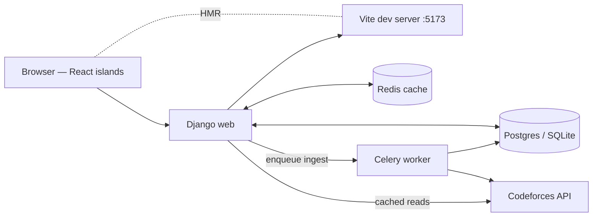

# ProblemBuddy


ProblemBuddy is a web application for competitive programmers on
[Codeforces](https://codeforces.com). It compares a user's solved-problem record
against reference data from successful contestants, identifies weak tags, and
recommends unsolved problems that target those gaps.

## Table of contents

- [Architecture](#architecture)
- [Prerequisites](#prerequisites)
- [Run it locally (step by step)](#run-it-locally-step-by-step)
- [Daily development workflow](#daily-development-workflow)
- [Production build](#production-build)
- [Run it with Docker](#run-it-with-docker)
- [Environment variables](#environment-variables)
- [Testing & linting](#testing--linting)
- [Troubleshooting](#troubleshooting)
- [Project layout](#project-layout)
- [Contributing](#contributing)
- [License](#license)

## Architecture



Two Django apps plus a React frontend:

- **Dataset** — `Problem` and `Counter` models; Codeforces API wrapper in
  [`Dataset/codeforces.py`](Dataset/codeforces.py); ingestion in
  [`Dataset/add_data.py`](Dataset/add_data.py); Celery task in
  [`Dataset/tasks.py`](Dataset/tasks.py).
- **Recommender** — auth, `Profile` (cf_handle + preferences),
  `ProblemInteraction` (solved/skipped), recommendation engine in
  [`Recommender/problem_giver.py`](Recommender/problem_giver.py), JSON API in
  [`Recommender/api.py`](Recommender/api.py).
- **frontend/** — Vite + React 18 + TypeScript; islands mounted on
  `data-react-island` divs. Tanstack Query handles caching, Zustand handles
  theme/toasts.

Rating tiers are centralised in
[`Dataset/constants.py`](Dataset/constants.py) and recommender index caches are
invalidated via [`Dataset/signals.py`](Dataset/signals.py).

## Prerequisites

You need these on your machine before starting:

| Tool | Minimum version | Check with |
| --- | --- | --- |
| Python | 3.11 (3.12 recommended) | `python3 --version` |
| Node.js | 20 LTS | `node --version` |
| npm | 10+ | `npm --version` |
| Git | any recent | `git --version` |

macOS install tips:

```bash
brew install python@3.12 node           # via Homebrew
# or use pyenv + nvm if you prefer version managers
```

## Run it locally (step by step)

This is the **first-time setup**. Later runs only need the "daily development
workflow" section below.

### 1. Clone and enter the repo

```bash
git clone https://github.com/TheRakibJoy/ProblemBuddy.git
cd ProblemBuddy
```

### 2. Create the Python virtual environment

```bash
python3 -m venv .venv
source .venv/bin/activate          # Windows: .venv\Scripts\activate
python -V                          # should report 3.11 or 3.12
pip install --upgrade pip
pip install -r requirements-dev.txt
```

### 3. Create a `.env` file

```bash
cp .env.example .env
```

Generate a secret key and paste it into `.env` as `DJANGO_SECRET_KEY`:

```bash
python -c "from django.core.management.utils import get_random_secret_key; print(get_random_secret_key())"
```

Keep `DJANGO_DEBUG=True` and `DJANGO_SETTINGS_MODULE=ProblemBuddy.settings.dev`
for local work. Leave `DATABASE_URL` and `REDIS_URL` blank — the dev defaults
use SQLite and an in-memory cache.

### 4. Initialise the database

```bash
python manage.py migrate
python manage.py create_default_groups   # creates the `contestant` and `admin` groups
python manage.py createsuperuser         # optional — needed for /admin/
```

### 5. Install the frontend dependencies

```bash
cd frontend
npm install
cd ..
```

### 6. Start both servers (two terminals)

**Terminal 1 — Django (port 8000):**

```bash
source .venv/bin/activate
python manage.py runserver
```

**Terminal 2 — Vite (port 5173, for React HMR):**

```bash
cd frontend
npm run dev
```

Both must be running. Vite serves the React JavaScript; Django serves the
HTML pages that mount it.

### 7. Open the app

Visit **http://127.0.0.1:8000** (not :5173 — that's just the asset server).

- Click **Sign up** to create an account.
- On first login you'll be redirected to **/onboarding/** to link your
  Codeforces handle.
- Submit a strong Codeforces handle (like `tourist`) at **/input_handle/** to
  seed recommendation data. You can also do this from the shell:
  ```bash
  python manage.py shell -c "from Dataset.add_data import ingest_all_tiers; ingest_all_tiers('tourist')"
  ```
- Visit **/recommender/** to get personalised problems.

That's it — you're running.

## Daily development workflow

After first-time setup, starting the app is just:

```bash
# Terminal 1
source .venv/bin/activate
python manage.py runserver

# Terminal 2
cd frontend && npm run dev
```

Ctrl+C in either terminal to stop. Both support hot reload — edit Python or
TypeScript and your changes appear without a restart.

## Production build

In production, Django serves the pre-built JS bundle (no Vite dev server):

```bash
cd frontend && npm run build          # emits frontend/dist/
cd ..
DJANGO_SETTINGS_MODULE=ProblemBuddy.settings.prod \
  python manage.py collectstatic --noinput
gunicorn ProblemBuddy.wsgi:application --bind 0.0.0.0:8000
```

Set `DJANGO_DEBUG=False`, a real `DJANGO_SECRET_KEY`, `DJANGO_ALLOWED_HOSTS`,
and a `DATABASE_URL` pointing at Postgres in `.env` before running prod.

## Run it with Docker

One command spins up Postgres, Redis, Django (gunicorn), and a Celery worker:

```bash
cp .env.example .env                 # edit DJANGO_SECRET_KEY
docker compose up --build
```

Open <http://localhost:8000>. `docker compose down -v` to tear everything down
(including the database volume). The Dockerfile runs `npm run build` as part
of the image build, so no Vite dev server is needed inside the container.

## Environment variables

| Variable | Required | Default | Purpose |
| --- | --- | --- | --- |
| `DJANGO_SETTINGS_MODULE` | yes | `ProblemBuddy.settings.dev` | Selects dev or prod settings module |
| `DJANGO_SECRET_KEY` | yes | — | Django signing key. Rotate if leaked. |
| `DJANGO_DEBUG` | no | `False` | Must be `False` in prod |
| `DJANGO_ALLOWED_HOSTS` | prod | `` | Comma-separated hostnames |
| `DATABASE_URL` | no | SQLite | `postgres://user:pw@host:5432/db` |
| `REDIS_URL` | no | LocMem | `redis://host:6379/1` |
| `CELERY_BROKER_URL` | no | `REDIS_URL` | Celery broker |
| `DJANGO_SECURE_SSL_REDIRECT` | no | `True` (prod) | HTTPS redirect |

See [`.env.example`](.env.example) for a copy-paste starter.

## Testing & linting

```bash
make test             # pytest + coverage (backend)
make frontend-test    # vitest (frontend)
make lint             # ruff + bandit + eslint
```

CI runs backend tests on Python 3.11 and 3.12 plus a separate frontend job.
See [`.github/workflows/ci.yml`](.github/workflows/ci.yml).

## Troubleshooting

**"No module named 'django_vite'"** — you didn't install the new requirements.
Run `pip install -r requirements-dev.txt`.

**Pages load but the UI is empty / React widgets don't appear** — the Vite
dev server isn't running. Start it in a second terminal: `cd frontend && npm run dev`.

**"ERROR: Could not find a version that satisfies the requirement Django==5.0.4"**
— your venv uses Python 3.9 or older. Django 5 needs Python 3.10+. Recreate
the venv with a newer Python: `rm -rf .venv && /opt/homebrew/bin/python3.12 -m venv .venv`.

**"STATICFILES_DIRS does not exist"** warning about `frontend/dist` — harmless
in dev. It goes away after you run `npm run build` once.

**Codeforces handle not found** on onboarding — double-check spelling;
Codeforces is case-insensitive but typos are common. Handles like `tourist`,
`Um_nik`, `Radewoosh` are good seed targets.

**`manage.py migrate` complains about existing tables** — you're reusing an
old `db.sqlite3` from before the model refactor. Delete it and re-migrate:
`rm db.sqlite3 && python manage.py migrate && python manage.py create_default_groups`.

## Project layout

```
ProblemBuddy/
├── ProblemBuddy/          # Django project (settings/, urls.py, celery.py)
├── Dataset/               # Problem/Counter models, CF client, ingest
├── Recommender/           # Auth, api.py, Profile, problem_giver, signals
├── templates/             # Bootstrap 5 Django templates (shell for React)
├── static/                # Legacy CSS / images served by Django
├── frontend/              # Vite + React 18 + TypeScript
│   ├── src/
│   │   ├── api/          # Fetch client + endpoint wrappers + types
│   │   ├── recommend/    # RecommendPage island
│   │   ├── profile/      # ProfilePage + TierLadder + WeakTagsChart
│   │   ├── onboarding/   # OnboardingPage
│   │   ├── settings/     # SettingsPage
│   │   ├── train/        # TrainForm
│   │   ├── theme/        # System-follow theme store + toggle
│   │   ├── toast/        # Global toast store + container
│   │   ├── components/   # HandleValidator, TopProgress
│   │   ├── islands.tsx   # Mount registry
│   │   └── main.tsx      # Entry
│   └── vite.config.ts
├── tests/                 # pytest suite
├── Dockerfile             # node:20 build + python:3.12 runtime
├── docker-compose.yml     # web + worker + postgres + redis
├── Makefile
├── requirements.txt       # runtime deps
└── requirements-dev.txt   # + pytest / ruff / bandit
```

## Contributing

1. Fork the repo
2. `git checkout -b feature/your-feature`
3. Make changes, run `make lint test frontend-test`
4. Push and open a PR

## License

[MIT](LICENSE).

## Contact

Questions: `rakibhjoy@gmail.com`.
