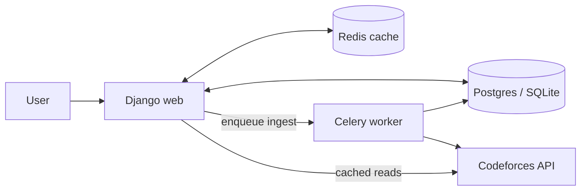

# ProblemBuddy


ProblemBuddy is a web application for competitive programmers on
[Codeforces](https://codeforces.com). It compares a user's solved-problem record
against reference data from successful contestants, identifies weak tags, and
recommends unsolved problems that target those gaps.

## Table of contents

- [Architecture](#architecture)
- [Quick start (local)](#quick-start-local)
- [Quick start (Docker)](#quick-start-docker)
- [Environment variables](#environment-variables)
- [Testing & linting](#testing--linting)
- [Project layout](#project-layout)
- [Contributing](#contributing)
- [License](#license)

## Architecture



Two Django apps:

- **Dataset** — stores `Problem` (Codeforces problems tagged by rating tier)
  and `Counter` (per-tier tag frequencies used as a reference). Wraps the
  Codeforces HTTP API in [`Dataset/codeforces.py`](Dataset/codeforces.py) with
  caching and specific error handling.
- **Recommender** — exposes `Home`, `Login`, `Register`, `Recommend`, `Profile`
  views. Uses [`Recommender/problem_giver.py`](Recommender/problem_giver.py)
  (cached `CountVectorizer` + cosine similarity) to rank unsolved problems
  against a user's weak tags.

Rating tiers are centralised in
[`Dataset/constants.py`](Dataset/constants.py) and invalidated caches are
managed via signal handlers in
[`Dataset/signals.py`](Dataset/signals.py).

## Quick start (local)

Requires Python 3.11+ and Node 20+.

```bash
git clone https://github.com/TheRakibJoy/ProblemBuddy.git
cd ProblemBuddy
python3 -m venv .venv && source .venv/bin/activate
pip install -r requirements-dev.txt
cp .env.example .env                       # fill in DJANGO_SECRET_KEY

python manage.py migrate
python manage.py create_default_groups     # creates `contestant` and `admin` groups
python manage.py createsuperuser           # optional: admin/ access

# Backend
python manage.py runserver

# Frontend (separate terminal — enables React island HMR on :5173)
cd frontend && npm install && npm run dev
```

Visit <http://localhost:8000>. The React islands mount automatically on every page
that ships a `data-react-island` div. For production, run `npm run build` once —
`django-vite` reads the emitted `frontend/dist/manifest.json` and serves hashed
assets via `collectstatic`.

Seed recommender data by logging in as an admin-group user and submitting a
strong Codeforces handle (e.g. `tourist`) via `/input_handle/`, or call:

```bash
python manage.py shell -c "from Dataset.add_data import ingest_all_tiers; ingest_all_tiers('tourist')"
```

## Quick start (Docker)

```bash
cp .env.example .env
docker compose up --build
```

Spins up Postgres + Redis + Django (gunicorn) + Celery worker on
<http://localhost:8000>.

## Environment variables

| Variable | Required | Default | Purpose |
| --- | --- | --- | --- |
| `DJANGO_SETTINGS_MODULE` | yes | `ProblemBuddy.settings.dev` | Selects dev or prod settings module |
| `DJANGO_SECRET_KEY` | yes | — | Django signing key. Rotate if leaked. |
| `DJANGO_DEBUG` | no | `False` | Must be `False` in prod |
| `DJANGO_ALLOWED_HOSTS` | prod | `` | Comma-separated hostnames |
| `DATABASE_URL` | no | SQLite | `postgres://user:pw@host:5432/db` |
| `REDIS_URL` | no | LocMem | `redis://host:6379/1` |
| `CELERY_BROKER_URL` | no | `REDIS_URL` | Celery broker |
| `DJANGO_SECURE_SSL_REDIRECT` | no | `True` (prod) | HTTPS redirect |

See [`.env.example`](.env.example) for a copy-paste starter.

## Testing & linting

```bash
make test       # pytest + coverage
make lint       # ruff + bandit
```

CI runs the same checks on every PR via
[`.github/workflows/ci.yml`](.github/workflows/ci.yml) across Python 3.11 and
3.12.

## Project layout

```
ProblemBuddy/
├── Dataset/            # Problem + Counter models, Codeforces client, ingest
├── Recommender/        # Auth views, recommendation engine, management commands
├── ProblemBuddy/       # Project + settings package (base/dev/prod) + celery.py
├── templates/          # Bootstrap 5 templates
├── static/             # CSS, images
├── tests/              # pytest suite (target, codeforces, problem_giver, views)
├── Dockerfile
├── docker-compose.yml
├── Makefile
└── requirements*.txt
```

## Contributing

1. Fork the repo
2. `git checkout -b feature/your-feature`
3. Make changes, run `make lint test`
4. Push and open a PR

## License

[MIT](LICENSE).

## Contact

Questions: `rakib@inverseai.com`.
